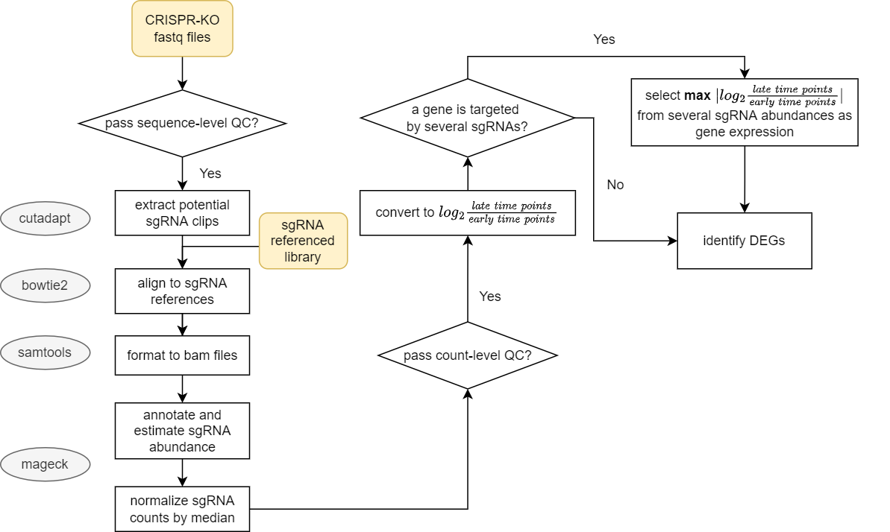
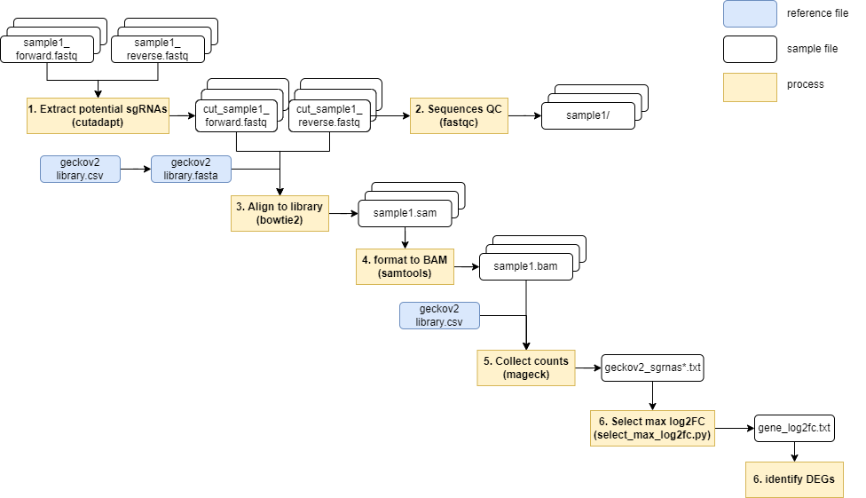
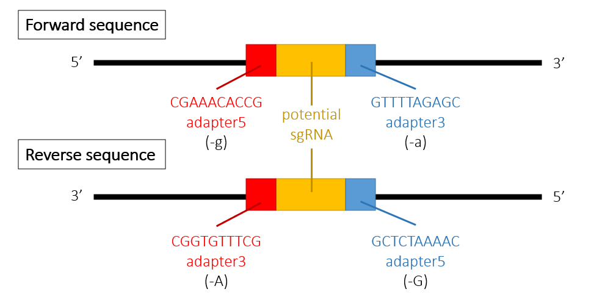

# Genome-wide pooled CRISPR/Cas9-KO data analysis method
## Outline
- [Flowchart](#flowchart)
- [Requested packages](#requirements)
- [Environment setup](#environment)
- [User guide](#user_guide)
- [Quality control](#qc)

<a name="flowchart"></a>
## Flowchart[^1]


<a name="requiremnets"></a>
## Requested packages
- python 3.7
- cutadapt 1.18
- fastqc 0.11.9
- bowtie2 2.2.5
- samtools 1.6
- mageck 0.5.9.2

<a name="environment"></a>
## Environment setup
```
# buildup
conda env create -f environment.yml
# initiate
source activate crisprenv
# finish
conda deactivate
```

<a name="user_guide"></a>
## User guide
### For single-end sequencing
[See more](https://www.ncbi.nlm.nih.gov/geo/query/acc.cgi?acc=GSM3738274)

### For pair-end sequencing
#### Processing overview


#### Process details

 1. Extract potential sgRNA clips

	##### Command

	```
	cutadapt -n 2 -g 'CGAAACACCG' -a 'GTTTTAGAGC' -G 'GCTCTAAAAC' -A 'CGGTGTTTCG' --discard-untrimmed -o cut_sample1_7day_forward.fastq -p cut_sample1_7day_reverse.fastq raw_data/sample1_7day_forward.fastq raw_data/sample1_7day_reverse.fastq > cut_sample1_7day.log 
	```

	

	##### Execution result
	```
	This is cutadapt 3.7 with Python 3.9.2
	Command line parameters: -n 2 -g CGAAACACCG -a GTTTTAGAGC -G GCTCTAAAAC -A CGGTGTTTCG --discard-untrimmed -o cut_sgrna/cut_sample1_7day_forward.fastq -p cut_sgrna/cut_sample1_7day_reverse.fastq raw_data/sample1_7day_forward.fastq raw_data/sample1_7day_reverse.fastq
	Processing reads on 1 core in paired-end mode ...
	Finished in 0.05 s (46 µs/read; 1.30 M reads/minute).
	```

 2. Check the quality of sequences
	
	##### Command 
	```
	mkdir sample1_forward
	fastqc -o sample1_forward cut_sample1_forward.fastq
	```
	
 3. Align to referenced sgRNA library (ex. geckov2 library)

	(1) convert CSV to fasta format of sgRNA library file
	
	##### Command 
	```
	awk -F ',' '{print ">"$1"\n"$2}' geckov2_library.csv > geckov2_library.fasta
	```	

	(2) build sgRNA indexes by sgRNA library fasta file
	
	##### Command 
	```
	mkdir sgrna_index
	bowtie2-build -f geckov2_library.fasta sgrna_index/geckov2_library
	```

	> It works when `Total time for backward call to driver() for mirror index: 00:00:00` showing in the end.

	(3) align potential clips to the library
	
	##### Command 
	```
	bowtie2 -p 8 --norc -x sgrna_index/geckov2_library -1 cut_sample1_7day_forward.fastq -2 cut_sample1_7day_reverse.fastq -S sample1_7day.sam 2> alignment_sample1_7day.log
	```

 4. Format to BAM files
	
	##### Command 
	```
	samtools view -bSq 10 sample1_7day.sam > sample1_7day.bam
	```
 5. Collect sgRNA normalized counts
	
	##### Command 
	```
	mkdir sgrna_counts
	mageck count -l geckov2_library.csv -n sgrna_counts/geckov2_sgrnas --sample-label sample1_7day,sample1_21day --fastq sample1_7day.bam sample1_21day.bam
	```
	
	##### Execution result 

	The content is documented in `sgrna_counts/geckov2_sgrnas.log`.

 6. Select max |log2 Fold change| as gene expression
	
	##### Command 
	```
	python select_max_logFC.py sgrna_counts/geckov2_sgrnas.count_normalized.txt "sample1_7day,sample1_21day" "gene-based_log2FC_sample1.txt"
	```

 7. Identify DEGs

<a name="qc"></a>
## Quality control
### Sequence-level
1. raw sequencing reads > 15,000,000[^2]
2. similar GC content distribution[^3]
3. the lowest median of base quality > Q25[^3]
### Count-level
4. mean of sgRNAs counts at early time point > 300[^3]
5. % mapped sgRNAs ratio > 65%[^3]
6. 0 sgRNAs at early time point < 1%[^3]
7. expression changes of non-targeting control genes are steady (around 0)[^4]   

## References

[^1]: Nechiporuk T, Kurtz SE, Nikolova O, Liu T, Jones CL, D'Alessandro A, Culp-Hill R, d'Almeida A, Joshi SK, Rosenberg M, Tognon CE, Danilov AV, Druker BJ, Chang BH, McWeeney SK, Tyner JW. The TP53 Apoptotic Network Is a Primary Mediator of Resistance to BCL2 Inhibition in AML Cells. Cancer Discov. 2019 Jul;9(7):910-925. 

[^2]: Meyers RM, Bryan JG, McFarland JM, Weir BA, Sizemore AE, Xu H, Dharia NV, Montgomery PG, Cowley GS, Pantel S, Goodale A, Lee Y, Ali LD, Jiang G, Lubonja R, Harrington WF, Strickland M, Wu T, Hawes DC, Zhivich VA, Wyatt MR, Kalani Z, Chang JJ, Okamoto M, Stegmaier K, Golub TR, Boehm JS, Vazquez F, Root DE, Hahn WC, Tsherniak A. Computational correction of copy number effect improves specificity of CRISPR-Cas9 essentiality screens in cancer cells. Nat Genet. 2017 Dec;49(12):1779-1784.

[^3]: Li W, Köster J, Xu H, Chen CH, Xiao T, Liu JS, Brown M, Liu XS. Quality control, modeling, and visualization of CRISPR screens with MAGeCK-VISPR. Genome Biol. 2015 Dec 16;16:281.

[^4]: Caeser R, Di Re M, Krupka JA, Gao J, Lara-Chica M, Dias JML, Cooke SL, Fenner R, Usheva Z, Runge HFP, Beer PA, Eldaly H, Pak HK, Park CS, Vassiliou GS, Huntly BJP, Mupo A, Bashford-Rogers RJM, Hodson DJ. Genetic modification of primary human B cells to model high-grade lymphoma. Nat Commun. 2019 Oct 4;10(1):4543.
