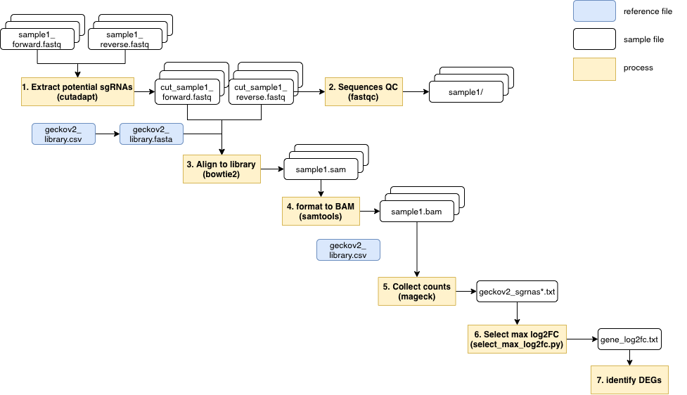

# Genome-wide pooled CRISPR/Cas9-KO data analysis method
## Outline
- [Flowchart](#flowchart)
- [Requested packages](#requirements)
- [Environment setup](#environment)
- [User guide](#user_guide)
- [Quality control](#qc)

<a name="flowchart"></a>
## Flowchart[^1]


<a name="requiremnets"></a>
## Requested packages
- python 3.7
- cutadapt 1.18
- fastqc 0.11.9
- bowtie2 2.2.5
- samtools 1.6
- mageck 0.5.9.2

<a name="environment"></a>
## Environment setup
```
# initiate
source activate crisprenv
# finish
conda deactivate
```

<a name="user_guide"></a>
## User guide
### For single-end sequencing
[See more](https://www.ncbi.nlm.nih.gov/geo/query/acc.cgi?acc=GSM3738274)

### For pair-end sequencing
#### Processing overview


#### Execution details
> Execution output shows in the log file documented by each step.

1. Extract potential sgRNA clips
	```
	cutadapt -n 2 -g 'CGAAACACCG' -a 'GTTTTAGAGC' -G 'GCTCTAAAAC' -A 'CGGTGTTTCG' --discard-untrimmed -o cut_sample1_7day_forward.fastq -p cut_sample1_7day_reverse.fastq raw_data/sample1_7day_forward.fastq raw_data/sample1_7day_reverse.fastq > cut_sample1_7day.log 
	```
	
2. Check the quality of sequences
	```
	mkdir sample1_forward
	fastqc -o sample1_forward cut_sample1_forward.fastq
	```
3. Align to referenced sgRNA library (ex. geckov2 library)

	(1) convert CSV to fasta format of sgRNA library file
	```
	awk -F ',' '{print ">"$1"\n"$2}' geckov2_library.csv > geckov2_library.fasta
	```	
	(2) build sgRNA indexes by sgRNA library fasta file
	```
	mkdir sgrna_index
	bowtie2-build -f geckov2_library.fasta sgrna_index/geckov2_library
	```
	> It works when `Total time for backward call to driver() for mirror index: 00:00:00` showing in the end.

	(3) align potential clips to the library
	```
	bowtie2 -p 8 --norc -x sgrna_index/geckov2_library -1 cut_sample1_7day_forward.fastq -2 cut_sample1_7day_reverse.fastq -S sample1_7day.sam 2> alignment_sample1_7day.log
	```
4. Format to BAM files
	```
	samtools view -bSq 10 sample1_7day.sam > sample1_7day.bam
	```
5. Collect sgRNA normalized counts
	```
	mkdir sgrna_counts
	mageck count -l geckov2_library.csv -n sgrna_counts/geckov2_sgrnas --sample-label sample1_7day,sample1_21day --fastq sample1_7day.bam sample1_21day.bam
	```
	> Log file is sgrna_counts/geckov2_sgrnas.log.

6. Identify DEGs

<a name="qc"></a>
## Quality control
### Sequence-level
1. sequencing reads > 15,000,000
2. similar GC content distribution
3. the lowest median of base quality > Q25
### Count-level
4. mean of sgRNAs counts at early time point > 300
5. % mapped sgRNAs ratio > 65%
6. 0 sgRNAs at early time point < 1%
7. expression changes of non-targeting control genes are steady (around 0)   

## References

[^1]: Nechiporuk T, Kurtz SE, Nikolova O, Liu T, Jones CL, D'Alessandro A, Culp-Hill R, d'Almeida A, Joshi SK, Rosenberg M, Tognon CE, Danilov AV, Druker BJ, Chang BH, McWeeney SK, Tyner JW. The TP53 Apoptotic Network Is a Primary Mediator of Resistance to BCL2 Inhibition in AML Cells. Cancer Discov. 2019 Jul;9(7):910-925. 